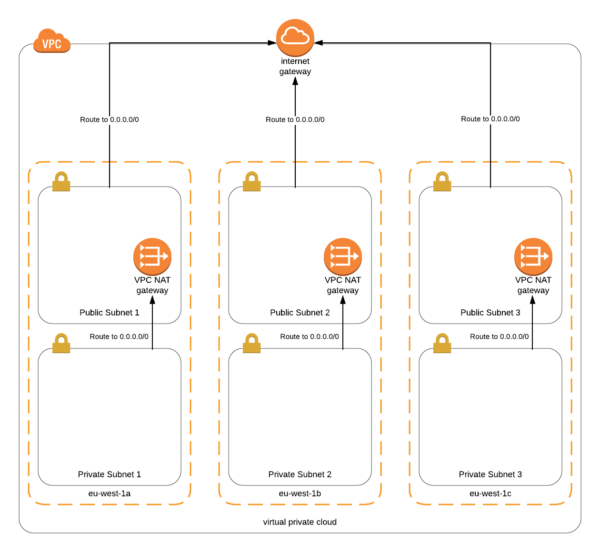

# Reaktor Common Terraform Modules - VPC

This Terraform module creates a basic multi-AZ AWS VPC setup that is very common in many projects.
It is intended to be used as a starting point for your VPC configuration.

## Architecture

The module creates a two-tier VPC networking setup. The module can create either private or public subnets
based on the amount of valid CIDR blocks you give to the module. Considering an example where the module is given
three CIDR blocks for private subnets and three CIDR blocks for public subnets, the VPC architecture should be something like this:



## Usage

You can use this module directly from GitHub by calling the module in your Terraform config like this:

```hcl
module "network" {
  source = "github.com/reaktor/terraform-module-vpc"

  project_name = "example-project"
  environment  = "dev"

  vpc_cidr_block = "10.10.8.0/21"

  private_subnet_cidr_blocks = [
    "10.10.8.0/24",
    "10.10.9.0/24",
    "10.10.10.0/24",
  ]

  public_subnet_cidr_blocks = [
    "10.10.12.0/24",
    "10.10.13.0/24",
    "10.10.14.0/24",
  ]
}
```

Alternatively you can copy this module into your Terraform configurations and call it with the `source = path/to/module` syntax.

### Variables

The module takes these variables:

- `project_name` **Required**. This name is used as a prefix in all the resource names as well as in the `Project` tag.
- `environment` **Required**. This variable is used in the resource tags.
- `vpc_cidr_block` **Required**. The whole VPC Network's IP Range in CIDR format (e.g. 10.10.8.0/21 or 10.0.0.0/16).
- `public_subnet_cidr_blocks` **Required**. At least one CIDR block for either public or private subnets is worthwhile.
- `private_subnet_cidr_blocks` **Required**. At least one CIDR block for either public or private subnets is worthwhile.
- `nat_gateway_elastic_ips` Conditional. The Elastic IP allocation IDs used for the NAT Gateways. This is required if `create_elastic_ips` is set to `false`.
- `create_elastic_ips` Optional. Set this to `true` or `false` if you want the module to create elastic IPs for the NAT Gateways. Default is `true`.
- `enable_dns_hostnames` Optional. Enable DNS Hostnames in your VPC. Default is `true`.
- `enable_dns_support` Optional. Enable DNS Support in your VPC. Default is `true`.

### Outputs

This module returns these outputs:

- `vpc_id` (String). The created VPC's ID.
- `public_subnet_ids` (List). The subnet IDs for the public subnets.
- `private_subnet_ids` (List). The subnet IDs for the private subnets.
- `subnet_availability_zones` (List). List of the availability zones used for the subnets.
- `private_route_table_ids` (List). Private subnet route table IDs.
- `public_route_table_id` (String). Public subnet route table ID.